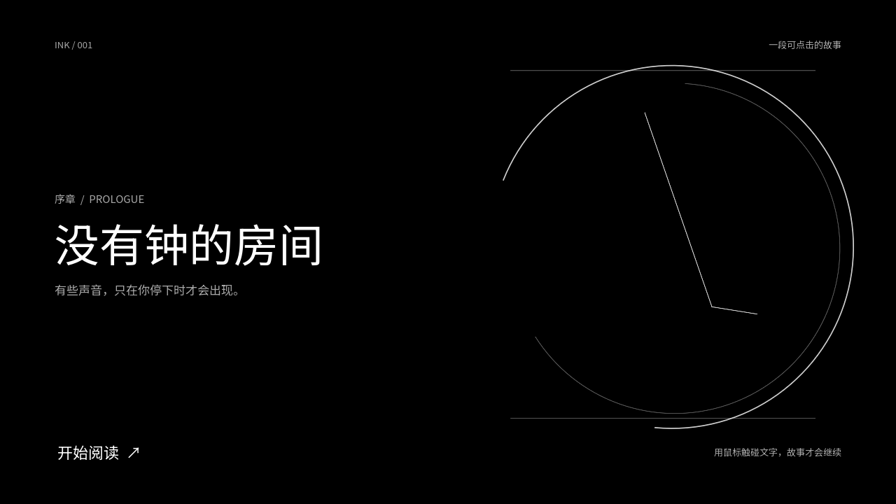
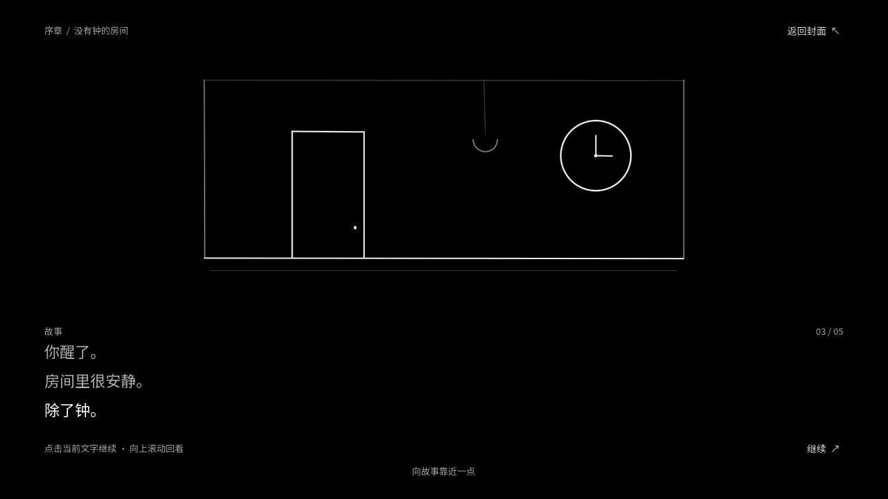
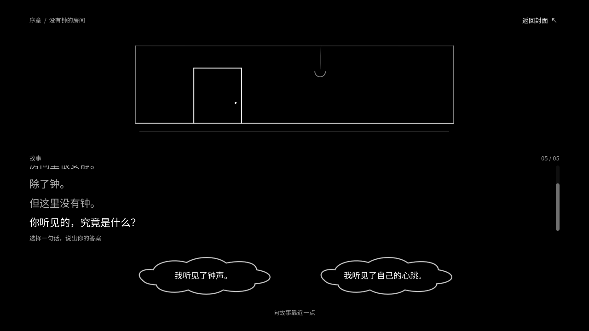
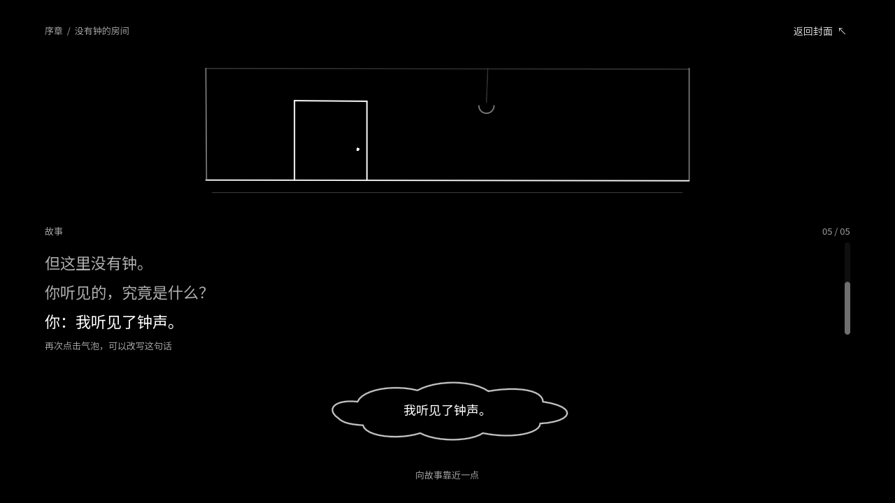

# 没有钟的房间

Godot 4.7.2 / GDScript 的黑白简笔画叙事样片。Windows PC 优先。

## 运行

1. 用 [Godot 4.7.2 stable](https://godotengine.org/download/archive/4.7.2-stable/) 打开本目录的 `project.godot`。
2. 按 **F6** 运行当前场景，或按 **F5** 运行整个项目。
3. 在封面点击“开始阅读”。点击当前文字或“继续”推进，滚动剧情区可回看旧内容。
4. 读到结尾后，点击一枚对话气泡作答。气泡会移到中间，再次点击可改写回答。右上角可返回封面。

所有画面和音效都在项目内，无需联网或安装插件。音效源文件由 `tools/generate_audio.py` 生成。字体使用系统中的 Noto Sans SC 或 Microsoft YaHei。

项目结构和下一步见 [docs/architecture.md](docs/architecture.md)。

## 画面预览









## 验证

在项目根目录执行：

```powershell
godot --headless --path . --script res://tests/smoke.gd
```

该脚本检查封面、逐句推进、时钟与音效、对话选择、回答编辑和返回封面。`tools/capture_previews.gd` 可在带图形界面的 Godot 中重新生成预览图。

