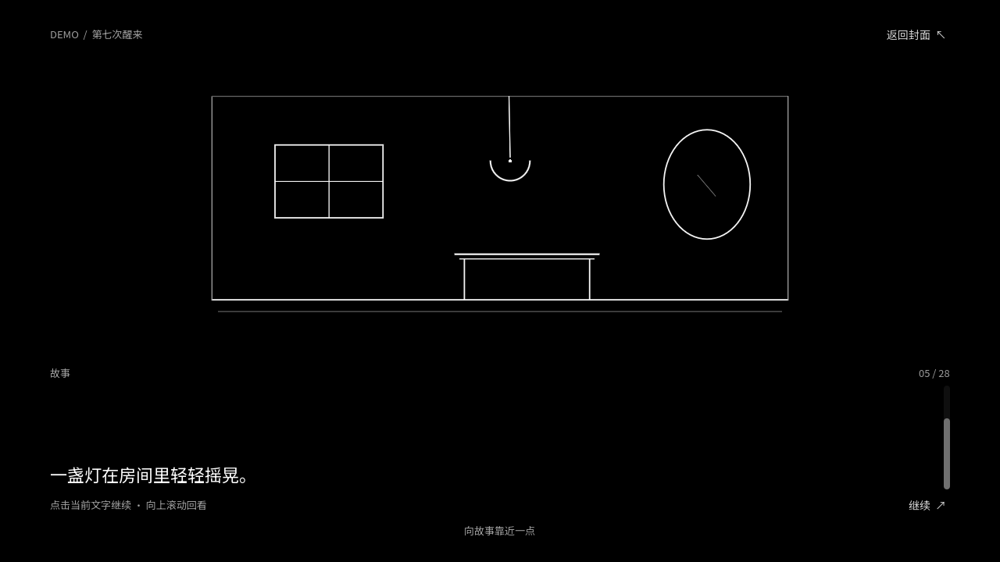
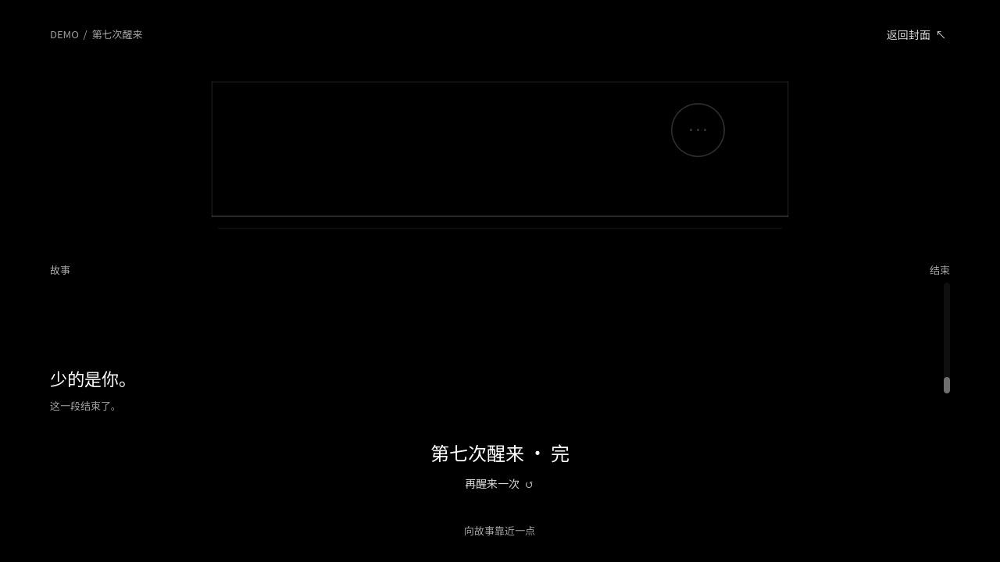

# 第七次醒来

一个以阅读节奏为核心的 Godot 4 黑白叙事 Demo。纯黑背景、白色简笔画和少量声音陪伴一段约 3 分钟的悬疑故事。玩家只需点击推进文字，最后从两个对话气泡中选择一句话；两种回答各有一句反馈，然后汇合到共同结尾。

## 运行

用 Godot 4.7.2 打开 [project.godot](project.godot)，按 **F5** 启动。在封面点击“开始阅读”。剧情中点击当前文字或右下角“继续”；打字过程中点击可立即显示整句，向上滚动可回看。遇到选择时点击气泡，气泡会移到中间；再次点击可改写显示的回答，然后点“继续”。结尾可重玩。

项目无需联网。音效源文件由 [tools/generate_audio.py](tools/generate_audio.py) 生成。每次游玩会在 Godot 用户数据目录的 `demo_sessions.jsonl` 记录完成情况、用时、提前显示整句的次数和选择，供阅读节奏测试使用。

## 画面预览







## 验证

在项目根目录执行：

```powershell
godot --headless --path . --script res://tests/smoke.gd
```

冒烟测试覆盖开场、停顿、物件消失、对话、两种选择、共同结尾、重玩和返回封面。用带图形界面的 Godot 运行 `res://tools/capture_previews.gd` 可重新生成预览图。代码与内容结构见 [docs/architecture.md](docs/architecture.md)。
